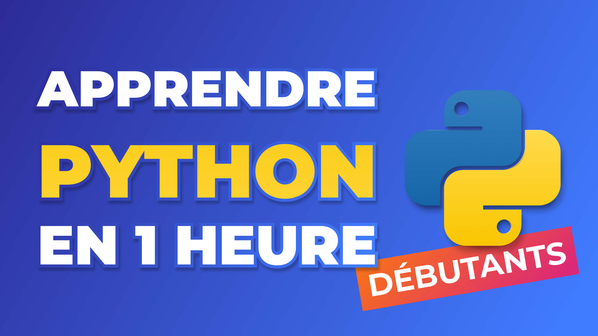

Lien vers la vidéo : 
- [Apprendre Python en 1 heure - Cours pour les débutants en Python 2024](https://www.youtube.com/watch?v=5EnpNI2iCZA)

## Série en plusieurs vidéos

Code et solutions des exercices et projets de la série de vidéos [Apprendre Python pour les Débutants 2024](https://www.youtube.com/playlist?list=PLeXyx0kOyiXtZfs2wNcIUqVlZBwunS3gO)

- [Partie 1 - Installer Python, un IDE & les variables](partie_1)
- [Partie 2 - Les conditions if, elif, else](partie_2)
- [Partie 3 - Les boucles while et les boucles for](partie_3)
- [Partie 4 - Les fonctions](partie_4)
- [Partie 5 - Tuples, Sets et Dictionnaires](partie_5)
- [Partie 6 - Les classes en Python](partie_6)
